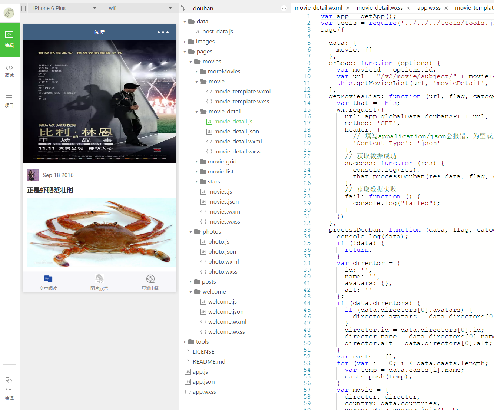
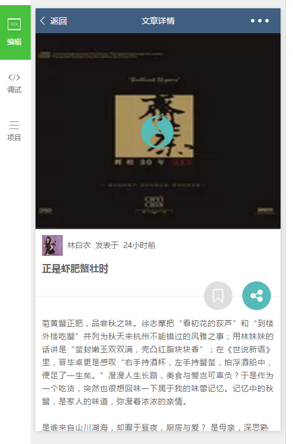
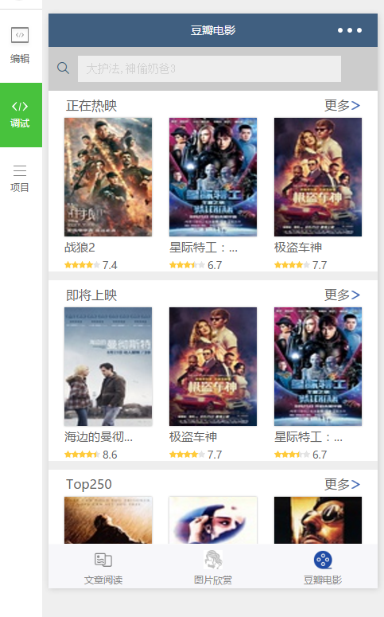
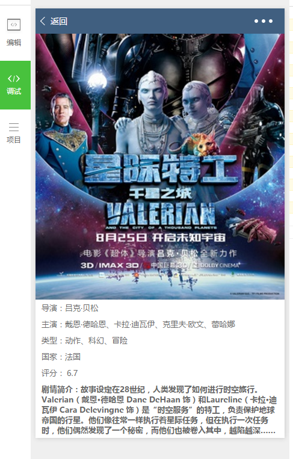
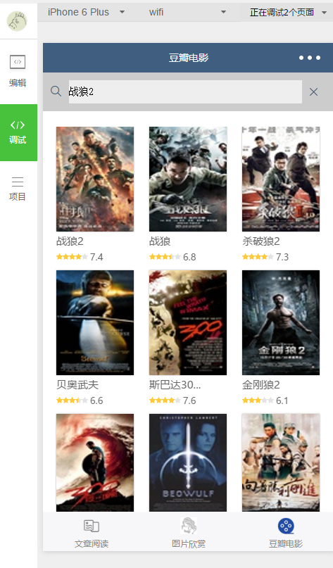
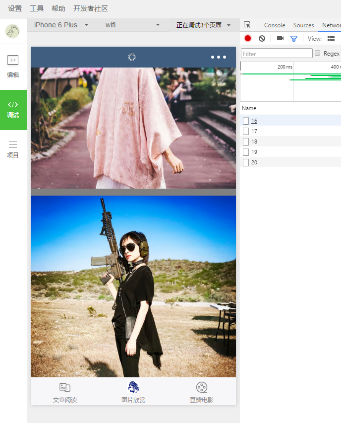

# 基于豆瓣电影 API 的微信小程序

> 紧跟时代潮流，学习新技术

## 使用

- clone或下载后，在**微信开发者工具**中打开即可查看效果

## 功能

- [x] 正在热映
- [x] 即将上映
- [x] top250
- [x] 电影搜索
- [x] 音乐播放
- [x] 文字阅读
- [x] 图片欣赏
- [X] 电影详情
- [X] 上滑加载更多

## 功能截图

#### 首页

#### 文字详情

#### 电影列表

#### 电影详情

#### 电影搜索

#### 图片欣赏

## API

- 豆瓣API [https://api.douban.com](https://api.douban.com)
- 干货集中营API [http://gank.io/api](http://gank.io/api)

## License

[MIT](LICENSE)